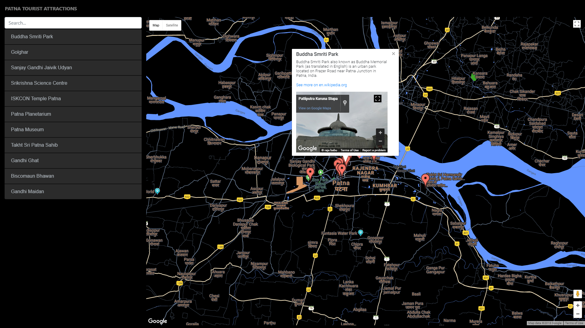

# Neighbourhood Map Project

Developed a Responsive single page Web Application featuring a map of Tourist Arrtactions near my City usinfg using __*KnockoutJS*__, __Google Maps API__ and __MediaWiki API__(wikipedia API). 

**Live version of this project is available at:**   
http://shubhamprakashjha.me/neighborhoodMap/

## Features
- highlighted locations
- WikiPedia Descriptions and link about those locations
- Street View Image of each location
- search filter 
- a listview of all the locations to browse easily.

## Technologies Used
- MediaWiki API
- Google Street View API
- Google Maps API
- KnockoutJS
- Bootstrap 
- jQuery
- vanilla JavaScript
- CSS3
- HTML5

## How to use
- Download the project's zip file.
- Extract the project from the Zip File
- Open `index.html` file in the browser.
- Search the name of place in the input box **or** 
 - Directly Click on the list of locations or markers 
 - InfoWindow is Displayed showing descriptions about the place and a street view image along with wikipedia article link
 - click on the link to get more information
 

## Discalimer 
If the map is showing __**for development perpose only**__. kindly get a google maps API key with streetView Service enabled and replace with my key, to use the app without any visual defects. Otherwise the app will run even without a new key.
